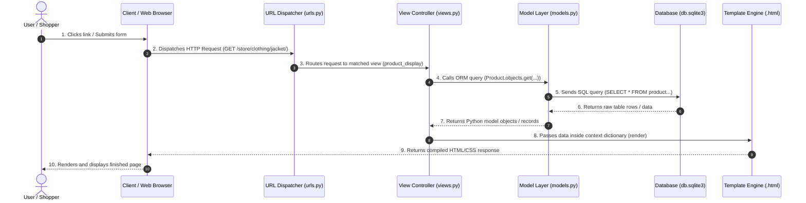
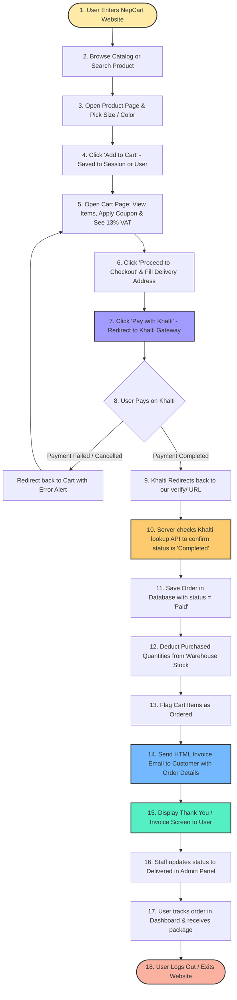
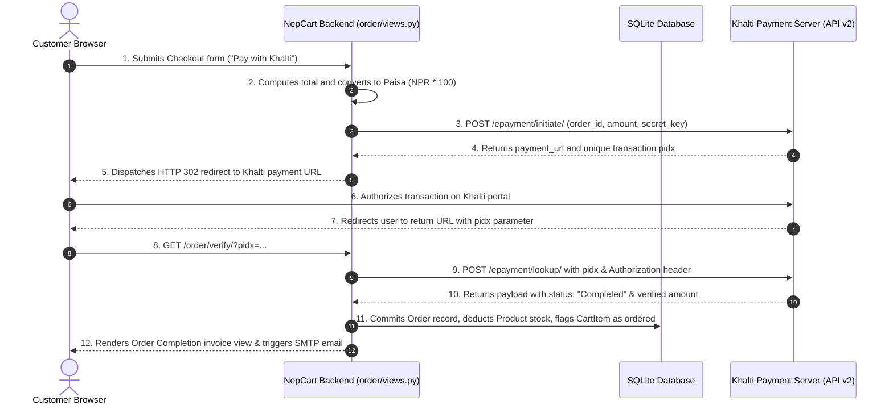

# NepCart E-Commerce: Presentation & Technical Defense Guide

> **Target Audience:** College Presentation, External Examiner, Viva Voce Committee  
> **Format:** Direct, structured technical web development explanations with presentation speaking points.

---

## Quick Navigation
1. [The 60-Second Elevator Pitch](#1-the-60-second-elevator-pitch)
2. [Technology Stack & Tools Used](#2-technology-stack--tools-used)
3. [High-Level Architecture: The Web Request Cycle](#3-high-level-architecture-the-web-request-cycle)
4. [Overall Flow: Customer Journey from Website Entry to Order Delivery](#4-overall-flow-customer-journey-from-website-entry-to-order-delivery)
5. [Transaction Architecture: Checkout & Khalti Payment Lifecycle](#5-transaction-architecture-checkout--khalti-payment-lifecycle)
6. [Core Technical Modules & Forms Validation](#6-core-technical-modules--forms-validation)
7. [Core Recommendation Algorithm: Item-to-Item Collaborative Filtering (Jaccard Similarity)](#7-core-recommendation-algorithm-item-to-item-collaborative-filtering-jaccard-similarity)
8. [Examiner Viva Q&A](#8-examiner-viva-qa)
9. [Key Points to Remember](#9-key-points-to-remember)

---

## 1. The 60-Second Elevator Pitch

When the external examiner or professor asks: **"Please introduce your project and summarize what you built."**

> *"Good morning / afternoon, respected examiners and teachers.*  
> 
> *My project is **NepCart**, a full-stack e-commerce web platform developed using **Python and the Django web framework** on the backend, **Bootstrap 4** on the frontend, and an **SQLite** relational database.*  
> 
> *The system manages the complete online commerce lifecycle: custom user registration and authentication using a **phone number**, dynamic product catalog filtering with multi-attribute variations (size and color), session-based shopping cart management with guest-to-user cart migration, promotional discount coupons, statutory 13% VAT calculation, and cashless checkout via the **Khalti Payment Gateway**.*  
> 
> *The application enforces standard security and integrity practices: input sanitization and validation via **Django Forms (`forms.py`)**, passwords encrypted via **PBKDF2-SHA256**, CSRF protection on mutating endpoints, server-to-server payment verification to prevent tampering, and transactional inventory stock deduction upon completed orders.*  
> 
> *Today, I will walk you through the technology stack, our architecture, and the complete transaction execution flow."*

---

## 2. Technology Stack & Tools Used

| Layer / Role | Technology Used | Why It Was Chosen |
| :--- | :--- | :--- |
| **Backend Language** | **Python 3.12** | Clean syntax, high readability, robust standard libraries, and industry standard for web services. |
| **Web Framework** | **Django 4.2 LTS** | "Batteries-included" framework providing built-in ORM, authentication, CSRF middleware, and form validation. |
| **Design Architecture** | **MVT (Model-View-Template)** | Cleanly separates database persistence, application business rules, and UI layout. |
| **Database** | **SQLite (`db.sqlite3`)** | Serverless, zero-configuration relational database ideal for development, testing, and academic project defense. |
| **Frontend Layout** | **HTML5 & Bootstrap 4** | Mobile-first, responsive grid system ensuring clean rendering across phones, tablets, and desktop computers. |
| **Icons & Media** | **Font Awesome 5 & Pillow** | Vector UI iconography and Python Imaging Library (Pillow) for product and category image processing. |
| **Form Validation** | **Django Forms (`forms.py`)** | Automated server-side data sanitization, type casting, length constraints, and custom clean routines. |
| **Payment Gateway** | **Khalti ePayment API (v2)** | Secure digital wallet and banking payment gateway widely adopted in Nepal. |
| **Admin Dashboard** | **Django Jazzmin** | Replaces default plain admin with an AdminLTE-based responsive management interface. |
| **Configuration** | **python-dotenv** | Isolates private credentials (`SECRET_KEY`, `KHALTI_SECRET_KEY`, SMTP passwords) inside a local `.env` file. |

---

## 3. High-Level Architecture: The Web Request Cycle

### Technical Architecture
NepCart implements Django's **MVT (Model-View-Template)** architecture (which is Django's implementation of MVC). It cleanly separates the application into distinct parts:

* **User / Shopper:** The human interacting with the system by clicking products, searching, or submitting forms.
* **Client / Web Browser:** The software (Chrome, Safari, Edge) that takes the user's action and sends an HTTP `GET` or `POST` request to the server.
* **URL Dispatcher (`urls.py`):** The router. It reads the requested web link and calls the correct Python function in `views.py`.
* **View Controller (`views.py`):** The brain/controller. It processes user input, checks permissions, asks the database for data, and decides which webpage to show.
* **Model Layer (`models.py`):** The data manager. It defines database tables and uses Django's ORM to read and write records in SQLite without manual SQL.
* **Template Engine (`.html`):** The visual page. It takes HTML and Bootstrap and injects server data into it so the browser can render a complete, formatted webpage for the user.

---

### Diagram 1A: MVT / MVC Architecture & Complete Data Flow

This diagram shows the complete cycle from the **User**, into the server and database, and back to the **User**:

```mermaid
graph TD
    User([User / Shopper])
    Browser[Client / Web Browser]
    URL["URL Dispatcher (urls.py)"]
    View["View Controller (views.py)"]
    Model["Model Layer (models.py)"]
    DB[("Database (db.sqlite3)")]
    Template["Template Engine (.html)"]

    %% Forward request flow
    User -->|1. Clicks link / Submits form| Browser
    Browser -->|2. Dispatches HTTP Request| URL
    URL -->|3. Routes request to matched view| View
    View -->|4. Calls ORM query method| Model
    Model -->|5. Sends SQL query (SELECT / INSERT)| DB

    %% Database return flow
    DB -->|6. Returns raw table rows / data| Model
    Model -->|7. Returns Python model objects / records| View

    %% View to Template & Response flow
    View -->|8. Passes data inside context dictionary| Template
    Template -->|9. Returns compiled HTML/CSS response| Browser
    Browser -->|10. Renders and displays finished page| User

    style User fill:#ffeaa7,stroke:#333,stroke-width:2px
    style Browser fill:#dfe6e9,stroke:#333,stroke-width:2px
    style View fill:#f9f,stroke:#333,stroke-width:2px
    style Model fill:#bbf,stroke:#333,stroke-width:2px
    style DB fill:#e0f7fa,stroke:#006064,stroke-width:2px
    style Template fill:#bfb,stroke:#333,stroke-width:2px
```

---

### Diagram 1B: End-to-End Web Request Lifecycle (Sequence Flow)

This sequence diagram mirrors the exact 10 steps from Diagram 1A:



---

### Component & Connection Breakdown for Diagrams 1A & 1B

1. **User / Shopper:** The person who initiates interactions (browsing products, filtering, adding to cart, or checking out).
2. **Client / Web Browser:** The client software that translates user clicks into HTTP requests, receives server responses, and renders the visual interface.
3. **URL Dispatcher (`urls.py`):** The router that reads incoming web paths and executes the corresponding controller function in `views.py`.
4. **View Controller (`views.py`):** The core controller containing business logic. It handles validation, permissions, requests data from models, and chooses the response template.
5. **Model Layer (`models.py`):** The data manager defining table schemas and using Django's ORM to perform database operations without raw SQL.
6. **Database (`db.sqlite3`):** The relational database storage engine where tables, columns, and persistent records reside.
7. **Template Engine (`.html`):** The presentation engine that merges dynamic data from the view into HTML/Bootstrap markup.

#### How to Explain This in a Presentation
> *"Our system follows the MVT pattern, which is Django’s implementation of MVC. The entire lifecycle is synchronized across 10 clear steps:*  
> *1. The **User** interacts with the **Web Browser** by clicking an item or submitting a form.*  
> *2. The **Browser** sends an HTTP request to Django's **URL Dispatcher**.*  
> *3. The **URL Dispatcher** matches the path and routes the call to the **View Controller**.*  
> *4. The **View Controller** runs the business logic and queries the **Model Layer** via Django's ORM.*  
> *5. The **Model Layer** executes an SQL query on the **SQLite Database**.*  
> *6. The **Database** returns raw data rows back to the **Model Layer**.*  
> *7. The **Model Layer** packages the rows into Python objects and passes them to the **View Controller**.*  
> *8. The **View Controller** bundles this data into a context dictionary and sends it to the **Template Engine**.*  
> *9. The **Template Engine** compiles the data into HTML and Bootstrap and delivers it to the **Browser**.*  
> *10. The **Browser** displays the final formatted webpage to the **User**."*

---

## 4. Overall Flow: Customer Journey from Website Entry to Order Delivery

### Technical Architecture & Execution Stages
This section describes the entire operational lifecycle of an order across 6 sequential stages: from initial HTTP entry as an anonymous visitor to final package delivery, automated transactional emails, and session termination.

---

### Diagram 2: Complete User Journey & Order Lifecycle

This flowchart shows the simple, step-by-step path every shopper takes from first entering the website to receiving their package:



---

### Step-by-Step Flow Breakdown (Matched Exactly to Code in `views.py`)

#### 1. Entering & Browsing the Store
* The user visits the homepage (`ecommerce/views.py:homepage`), which loads featured items, popular products, and categories.
* The user searches by keyword (`search/views.py:search`), which filters products whose name or description matches the query.
* Clicking any item opens the detail view (`store/views.py:product_display`), showing product photos, description, price, available variations (sizes and colors), and **Frequently Bought Together** recommendations.

#### 2. Selecting Variations & Adding to Cart
* The shopper selects a size and color from dropdowns and clicks **Add to Cart** (`cart/views.py:add_to_cart`).
* If the user is a guest, items are saved using the browser's `session_key`. If logged in, items are linked to the user account.
* On the cart page (`cart/views.py:cart`), the system computes:
  - **Subtotal:** Sum of all item prices $\times$ quantities.
  - **Statutory 13% Tax:** `tax = round(0.13 * total, 2)`.
  - **Promo Coupon:** `get_coupon_discount()` applies discounts (e.g. 20% off) if an active code was entered.
  - **Grand Total:** `max(0, round(total + tax - discount, 2))`.

#### 3. Checkout & Delivery Address
* The shopper clicks **Proceed to Checkout** (`cart/views.py:placeorder`).
* If not logged in, they are redirected to login (`account/views.py:logins`). Upon login, the system automatically runs the cart migration so their items are preserved.
* The customer enters their delivery info: country, state, city, and street address (`OrderAddress` with fields `country`, `state`, `city`, `address_line_1`). The recipient name and phone number are taken from the authenticated user's account.

#### 4. Initiating Khalti Cashless Payment (`order/views.py:payment`)
* The user clicks **Pay with Khalti**.
* The server converts the total into integer Paisa (`amount_in_paisa = int(round(grandtotal * 100))`).
* Our backend sends an HTTPS POST request to Khalti's `/epayment/initiate/` API with customer details, order amount breakdown, product list, and our `KHALTI_SECRET_KEY`.
* Khalti responds with a unique transaction token (`pidx`) and a `payment_url`.
* The server redirects the user's browser directly to Khalti's payment portal.

#### 5. Verification & Order Fulfillment (`order/views.py:verify`)
* The customer enters their mobile PIN on Khalti to approve the payment.
* Khalti redirects the user back to our callback URL: `/order/verify/?pidx=...`.
* **Server Verification:** Our backend immediately calls Khalti's `/epayment/lookup/` API using our private key to verify that the status is strictly `"Completed"` and the paid amount matches the expected order amount in Paisa.
* **Saving the Order:**
  - Creates a new `Order` record with `status = "Paid"`, `order_total`, and `tax`.
  - Attaches each cart item to the new order and marks `item.is_ordered = True`.
* **Inventory Deduction:** The system loops through each ordered item and decrements the stock:
  ```python
  item.product.stock = max(0, item.product.stock - item.quantity)
  item.product.save()
  ```
* **Clearing Coupon:** Removes the applied promo code from session (`request.session.pop('coupon_code', None)`).

#### 6. Automated Invoice Email & Order Confirmation
* **Email Dispatch:** Our server builds an HTML invoice using `render_to_string("order/order_complete.html", email_context)` and dispatches it via `EmailMultiAlternatives` to the customer's email.
* The email contains the order tracking number, purchased items, price breakdown, 13% VAT, discount, and delivery address.
* The customer is redirected to their order history (`dashbord/views.py:order`), where they can view all past orders grouped by status.

#### 7. Admin Processing, Delivery & Logout
* **Store Management:** Store staff log into the **Django Jazzmin** admin panel (`/admin/`), view the paid order and shipping address, package the products, and update the status to `Delivered`.
* **Order History:** The customer can view and track their past orders anytime in their dashboard (`dashbord/views.py:order`).
* **Delivery & Session Exit:** The package is physically delivered to the customer's address. The customer can safely log out (`account/views.py:logouts`).

---

#### How to Explain This in a Presentation
> *"Our customer journey follows a clear, end-to-end path:*  
> *1. The customer enters the site, searches for an item, and selects their preferred size and color variations.*  
> *2. They add the item to the cart, where the system calculates the subtotal, promo discounts, and Nepal's statutory 13% VAT.*  
> *3. At checkout, the customer provides their delivery address and clicks 'Pay with Khalti'.*  
> *4. Our backend converts the amount into Paisa and initiates the transaction with Khalti's v2 API, redirecting the user to Khalti.*  
> *5. After payment, Khalti redirects back to our verify endpoint. Our backend independently queries Khalti's lookup service to verify the status is 'Completed'.*  
> *6. Once confirmed, the system creates the order marked as 'Paid', deducts the purchased quantities from warehouse stock, and sends a complete HTML invoice email to the customer's inbox.*  
> *7. Finally, store staff process the order in the Jazzmin admin panel, and the customer tracks their package in their dashboard until delivery."*

---

## 5. Transaction Architecture: Checkout & Khalti Payment Lifecycle

### Technical Architecture
The checkout workflow employs a multi-phase verification protocol across client, application backend, and Khalti payment APIs:
1. **Payload Generation:** Server computes payable totals and formats currency into Paisa.
2. **Payment Initiation:** Server-to-server POST to Khalti v2 API requesting transaction authorization.
3. **Gateway Redirection:** User completes payment on Khalti's hosted domain.
4. **Server Verification:** Application backend queries Khalti's lookup endpoint independently to verify transaction authenticity prior to mutating database state.

---

### Diagram 3: Khalti Payment & Order Verification Sequence



---

### Component & Connection Breakdown for Diagram 3

1. **Steps 1–2 (Amount Computation):** The backend calculates the final order amount ($\text{Subtotal} + \text{VAT} - \text{Discount}$) and converts NPR to integer Paisa ($1 \text{ NPR} = 100 \text{ Paisa}$).
2. **Steps 3–5 (API Initiation):** The backend issues an HTTPS request to Khalti's `/epayment/initiate/` using the private `KHALTI_SECRET_KEY`. Khalti returns a unique identifier (`pidx`) and an authorization URL.
3. **Steps 6–7 (Payment Authorization):** The customer executes payment on Khalti's secure domain. Credentials are never exposed to NepCart servers.
4. **Steps 8–10 (Out-of-Band Verification):** Upon client callback, the backend performs a direct server-to-server query against Khalti's `/epayment/lookup/` endpoint, validating that the transaction status is `"Completed"` and matches the expected amount.
5. **Steps 11–12 (State Persistence & Fulfillment):** The backend creates the `Order` record with `status='Paid'`, decrements stock from inventory, flags each `CartItem` as `is_ordered=True` (linking it to the new order), and dispatches an invoice via SMTP.

#### How to Explain This in a Presentation
> *"Our Khalti payment works in three simple steps:*  
> *1. The user goes to Khalti's secure page to pay.*  
> *2. When they return, our server independently verifies with Khalti that the money was actually received.*  
> *3. Once confirmed, we save the paid order, decrease the warehouse stock, and email the invoice to the customer."*

---

## 6. Core Technical Modules & Forms Validation

---

### Module 1: Custom User Authentication (Phone-Based Login)

* **What It Is:** An authentication module where `phone_number` serves as the primary unique credential instead of a standard `username`.
* **Why We Need It:** Aligns with standard mobile-centric authentication patterns in Nepal, reducing registration friction and simplifying order delivery tracking.
* **How It Works Step-by-Step:**
  1. Extends `AbstractUser` inside [`account/models.py`](file:///c:/Users/Nirajan/Documents/antigravity/hopeful-hawking/account/models.py), adding `phone_number` and `is_verified` fields.
  2. During registration (`account/views.py:signup`), the phone number is programmatically copied into Django's built-in `username` field, so authentication uses `authenticate(username=phone_number, password=password)`. The view manually checks for duplicate phone numbers before creating the account.
  3. Uses Django’s password hashing mechanism (**PBKDF2 with SHA-256**, 600,000 iterations, unique salt per record) via `set_password()`.
  4. Generates email verification tokens using HMAC-SHA256 (`default_token_generator`), activating accounts via `is_verified = True` upon confirmation.

#### How to Explain This in a Presentation
> *"We subclassed Django's AbstractUser to create a custom Account model where the unique identifier is the user's phone number. Passwords are never stored in plaintext; they are hashed using PBKDF2 with SHA-256 encryption. We also implemented account verification using cryptographically signed email tokens."*

---

### Module 2: Product Catalog & Dynamic Variations

* **What It Is:** A normalized product management schema supporting multiple attributes (sizes, colors) under parent catalog items.
* **Why We Need It:** Avoids redundant product records for different sizes or colors, preserving clean category listings while maintaining precise inventory tracking.
* **How It Works Step-by-Step:**
  1. `Product` defines core properties: `product_name`, `slug`, `price` (with `initial_price` for original/discount tracking), `image`, `stock`, `is_available`, `is_popular`, `is_featured`, and `catogery` (foreign key to category).
  2. `Variation` maintains foreign key references to `Product`, specifying `variation_category` (`'size'`, `'color'`) and `variation_value`.
  3. Product detail views query variations grouped by category, rendering dynamic `<select>` options.
  4. Selected variation IDs are attached to `CartItem` instances upon addition to cart.

#### How to Explain This in a Presentation
> *"Our catalog architecture uses a normalized Variation model related to the main Product model. This allows a single product to offer multiple sizes and colors without duplicating catalog entries. Selected variations are tracked directly on each cart line item."*

---

### Module 3: Shopping Cart & Session-to-User Merging

* **What It Is:** A dual-mode cart tracking mechanism handling both anonymous guest sessions and authenticated users.
* **Why We Need It:** Prevents shopping cart abandonment by allowing visitors to select items before logging in or registering.
* **How It Works Step-by-Step:**
  1. **Anonymous Cart:** Assigns `CartItem` rows to `request.session.session_key` stored in the client's session cookie.
  2. **Global Cart Counter:** A Django context processor executes across all requests to supply active cart counts to the navigation bar.
  3. **Cart Migration:** During authentication in `logins()`, the view queries existing `CartItem` records matching the visitor's `session_key` and reassigns each one to the authenticated user (`x.user = user`). Note: it does not merge quantities with any existing user cart items — it simply transfers ownership.

#### How to Explain This in a Presentation
> *"The cart system supports both session-based guest carts and authenticated user carts. If a guest adds products and later logs in, our authentication view executes a migration routine that reassigns those session cart items to their user account, preventing cart loss."*

---

### Module 4: Pricing, Discounts & Statutory 13% VAT Engine

* **What It Is:** A financial calculation service computing itemized subtotals, promotional discounts, and legal tax requirements.
* **Why We Need It:** Satisfies Nepal's statutory 13% VAT requirement and ensures exact numeric reconciliation for the payment gateway API down to the Paisa.
* **How It Works Step-by-Step:**
  1. **Subtotal:**
     $$\text{Subtotal} = \sum_{i=1}^{n} (\text{Unit Price}_i \times \text{Quantity}_i)$$
  2. **Statutory Tax (13% VAT):**
     $$\text{VAT} = \text{round}(\text{Subtotal} \times 0.13, 2)$$
  3. **Coupon Evaluation:** Queries active `Coupon` objects by code, calculating proportional discount deductions:
     $$\text{Discount} = \text{Subtotal} \times \left(\frac{\text{Discount Rate}}{100}\right)$$
  4. **Payable Total:**
     $$\text{Grand Total} = \max(0, \text{Subtotal} + \text{VAT} - \text{Discount})$$

#### How to Explain This in a Presentation
> *"Our pricing logic handles subtotal aggregation, applies active coupon percentage discounts, and calculates Nepal's statutory 13% VAT. The grand total is rounded and converted to Paisa for Khalti processing, eliminating floating-point reconciliation errors."*

---

### Module 5: Khalti ePayment v2 & Stock Deduction

* **What It Is:** An integrated online payment gateway handling transaction initiation, remote verification, and inventory updates.
* **Why We Need It:** Provides a secure digital payment channel without storing card or wallet credentials, while ensuring real-time inventory consistency.
* **How It Works Step-by-Step:**
  1. Initiates transaction with Khalti's `/epayment/initiate/` API using merchant credentials, obtaining a `pidx` token.
  2. Redirects client to Khalti payment interface.
  3. Receives return callback at `/order/verify/?pidx=...`.
  4. Calls Khalti's `/epayment/lookup/` endpoint server-side to confirm payment status.
  5. Upon confirmation, creates the `Order` record, reduces product inventory:
     $$\text{Remaining Stock} = \max(0, \text{Current Stock} - \text{Ordered Quantity})$$
  6. Dispatches order confirmation email via Django's SMTP backend.

#### How to Explain This in a Presentation
> *"Our Khalti payment works in three simple steps:*  
> *1. The user goes to Khalti's secure page to pay.*  
> *2. When they return, our server independently verifies with Khalti that the money was actually received.*  
> *3. Once confirmed, we save the paid order, decrease the warehouse stock, and email the invoice to the customer."*

---

### Module 6: Django Jazzmin Administrative Back-Office

* **What It Is:** A customized administrative interface replacing the default Django admin panel with a responsive dashboard.
* **Why We Need It:** Provides store managers with an operational UI to manage catalog items, process orders, adjust stock, and review customer records.
* **How It Works Step-by-Step:**
  1. Configured via `django-jazzmin` in `INSTALLED_APPS`, applying an AdminLTE 3 UI theme.
  2. Governed by Django's built-in Role-Based Access Control (RBAC), restricted to staff (`is_staff = True`) and superuser accounts.
  3. Implements model admins with search fields, list filters, and inline forms for variations and order products.

#### How to Explain This in a Presentation
> *"For backend administration, we implemented Django Jazzmin, which provides a responsive dashboard for inventory and order management. Access is controlled via Django's role-based permissions, allowing staff to manage categories, products, stock levels, and customer orders."*

---

### Module 7: Form Validation & Data Sanitization (`forms.py`)

* **What It Is:** Dedicated form classes in [`account/forms.py`](file:///c:/Users/Nirajan/Documents/antigravity/hopeful-hawking/account/forms.py) and [`order/forms.py`](file:///c:/Users/Nirajan/Documents/antigravity/hopeful-hawking/order/forms.py) that validate, sanitize, and format user input on the server side.
* **Why We Need It:** Client-side HTML validation (like `required`) can be easily bypassed by attackers using browser developer tools or Postman. Server-side validation with Django Forms prevents SQL injection, invalid data types, malformed emails, and invalid phone numbers from reaching the database.
* **How It Works Step-by-Step:**
  1. **Form Definition:** Classes inherit from `django.forms.Form`:
     - `RegisterForm`: Enforces `min_length=10` and `max_length=10` on `phone_number`, `EmailField` validation on `email`, and `min_length=8` on `password`.
     - `LoginForm`: Validates phone and password input fields.
     - `OrderForm`: Validates shipping fields (`country`, `state`, `address_line_1`, `city`).
  2. **Data Binding & Sanitization:** In `views.py`, the form is bound to incoming data: `form = RegisterForm(request.POST)`.
  3. **Executing `is_valid()`:** Django triggers built-in validators, strips harmful characters, checks field lengths, and casts data types.
  4. **Accessing `cleaned_data`:** If valid, clean, type-safe data is extracted via `form.cleaned_data.get('phone_number')`.
  5. **Error Propagation:** If validation fails, Django automatically attaches error messages (e.g. *"Phone Number Cant Be Greater Than 10"*) and returns them to the template without crashing the server.

#### How to Explain This in a Presentation
> *"We handle input validation using Django’s `forms.py`. Never trusting the client browser alone, our backend checks all submitted data with `form.is_valid()`. It enforces exact constraints—such as 10-digit phone numbers, valid email structures, and minimum 8-character passwords. If validation passes, we safely extract sanitized data from `form.cleaned_data`; if it fails, the form automatically returns friendly error messages to the user without crashing the application."*

---

## 7. Core Recommendation Algorithm: Item-to-Item Collaborative Filtering (Jaccard Similarity)

### 7.1 Why We Use Jaccard Similarity (Explained in Simple Terms)
Most recommendation systems ask users to give 1 to 5 stars or write a review. But **NepCart does not have star ratings or reviews**.

Because there are no ratings in our system, we cannot use traditional rating-based algorithms. 

Instead, our system looks at **real actions**: what items customers actually put into their shopping carts and buy together. 

We use the **Jaccard Similarity** algorithm to see how often two items are bought together:
* If many shoppers buy a **Camera** and also put a **Memory Card** in their cart, the system learns they belong together.
* When a new shopper views that **Camera**, the system automatically recommends the **Memory Card** under **"Frequently Bought Together"**.

> *"Our app does not have star ratings or reviews. Instead of asking users for feedback, our system looks at what items customers actually add to their carts and buy together. Using the Jaccard Similarity algorithm, it recommends products that are frequently paired in real orders."*

### 7.2 Mathematical Formulation
The similarity between target Product $A$ and candidate Product $B$ is defined by the cardinality ratio of the intersection to the union of their purchaser sets:

$$\text{Jaccard Similarity}(A, B) = \frac{|U_A \cap U_B|}{|U_A \cup U_B|} = \frac{|U_A \cap U_B|}{|U_A| + |U_B| - |U_A \cap U_B|}$$

Where:
* $U_A$: Set of unique users and guest sessions who ordered or carted Product $A$.
* $U_B$: Set of unique users and guest sessions who ordered or carted Product $B$.
* $|U_A \cap U_B|$: Count of users who interacted with **both** Product $A$ and Product $B$ (co-occurrence).
* $|U_A \cup U_B|$: Total unique users who interacted with **either** Product $A$ or Product $B$.
* **Range:** $0.0 \le \text{Similarity}(A, B) \le 1.0$ ($0$ = zero co-purchases, $1$ = always bought together).

---

## 8. Examiner Viva Q&A

### Q1: "What is the difference between MVC and MVT in Django?"
* **Direct Answer:**  
  *"They share the same underlying architectural separation of concerns. In traditional MVC, the Controller processes business logic and the View handles presentation. In Django's MVT, the **View** acts as the Controller handling application logic and database interactions, while the **Template** serves as the presentation layer. Django's core URL router handles request dispatching."*

### Q2: "Why did you choose SQLite, and how would you scale to production?"
* **Direct Answer:**  
  *"SQLite is an embedded, serverless relational database that stores the database in a single file (`db.sqlite3`), making it lightweight for development and academic demonstration. Because Django utilizes an Object-Relational Mapper (ORM), the codebase is database-agnostic. We can transition to PostgreSQL or MySQL in production simply by altering the `DATABASES` configuration in `settings.py` and installing the database driver, requiring zero changes to application models or views."*

### Q3: "How does the system mitigate Cross-Site Request Forgery (CSRF) attacks?"
* **Direct Answer:**  
  *"Django enforces CSRF protection via middleware on all state-changing HTTP requests (`POST`, `PUT`, `DELETE`). Forms include a `` tag, which injects a secret token. When submitted, the `CsrfViewMiddleware` verifies that the form token matches the token stored in the user's cookie. Requests from external malicious origins lack this matching token and are rejected with a 403 Forbidden response."*

### Q4: "How does the system prevent payment tampering?"
* **Direct Answer:**  
  *"Payment verification is executed strictly server-side. The application never relies on client-provided parameters or query strings to confirm payment success. Upon return from Khalti, our backend sends an authenticated request directly to Khalti's `/epayment/lookup/` endpoint using our secret key. We inspect the verified status and amount returned directly by Khalti's server before updating the database."*

### Q5: "How are environment variables and sensitive keys managed?"
* **Direct Answer:**  
  *"Sensitive credentials—including Django's `SECRET_KEY`, database settings, SMTP email credentials, and the `KHALTI_SECRET_KEY`—are isolated in an external `.env` file and loaded at runtime using `python-dotenv`. The `.env` file is explicitly ignored in `.gitignore`, preventing credentials from being committed to source control."*

### Q6: "How do Django Forms protect against invalid or malicious input?"
* **Direct Answer:**  
  *"Instead of reading raw `request.POST` data directly, we bind requests to structured classes in `forms.py` (e.g. `RegisterForm`, `OrderForm`). Calling `form.is_valid()` executes server-side validation rules—verifying data types, enforcing length boundaries (like exactly 10 digits for phone numbers), and escaping dangerous characters to prevent cross-site scripting and injection attacks. Sanitized values are then securely accessed via `form.cleaned_data`."*

### Q7: "How does the recommendation algorithm handle the 'cold-start' problem for newly added products?"
* **Direct Answer:**  
  *"When a newly created product has zero co-purchases or cart history, pure collaborative filtering returns an empty set. To solve this, our engine implements a hybrid fallback strategy: it detects when Jaccard matches are below the target limit of 4, automatically queries active catalog products from the same category (`catogery=target_product.catogery`), and backfills the remaining slots so the user always sees relevant recommendations without site errors."*

---

## 9. Key Points to Remember

1. **Stack & Architecture:** Built with **Python 3.12** and **Django 4.2 LTS** implementing the **Model-View-Template (MVT)** pattern.
2. **Recommendation Engine:** Employs **Item-to-Item Collaborative Filtering** using **Jaccard Similarity** ($|A \cap B| / |A \cup B|$) with automated category cold-start resilience.
3. **Authentication:** Customized `AbstractUser` with **Phone Number** used as the login credential (programmatically mapped to Django's `username` field).
4. **Cart Persistence:** Implements **Session-to-User cart migration** to retain guest selections upon login.
5. **Calculations:** Programmatically computes **subtotals**, **coupon discounts**, and statutory **13% VAT**, converted to Paisa.
6. **Payment Integration:** Uses **Khalti ePayment API v2** with mandatory **server-to-server lookup verification**.
7. **Data Integrity:** Enforces relational constraints, foreign keys, and transactional inventory stock deduction upon completed purchase.
8. **Security Practices:** Leverages **PBKDF2-SHA256** password hashing, CSRF tokens, and runtime `.env` secret isolation.
